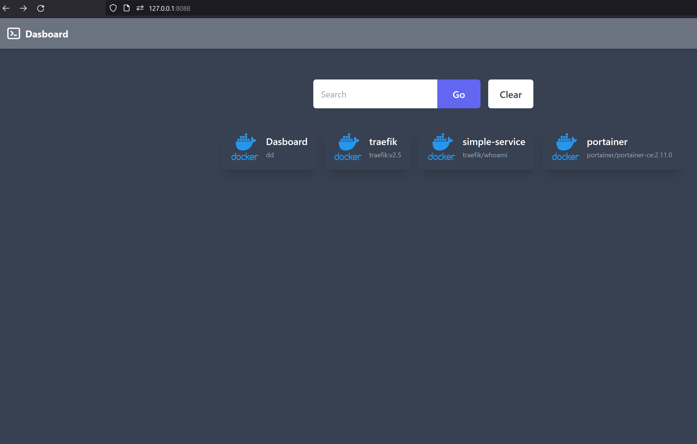

# docker-Dasboard

Simple Dashboard written in go (19MB Container, no config)

docker build -t dasboard .

docker run --rm -it -v /var/run/docker.sock:/var/run/docker.sock:ro -p 8088:8080 dasboard

available on docker hub: https://hub.docker.com/r/jrsmile/dasboard
